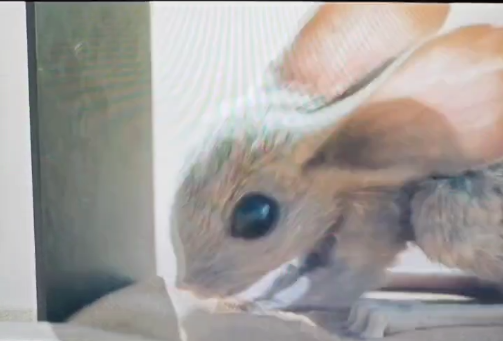
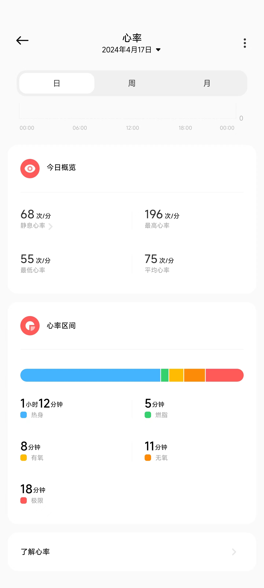

# 记

## 前言
吾因4.16于bilibili第二次观看某一博主的视频，他1:1正方形战士都定制计划健康生活开始减肥，遂乎吾决定趁吾还未至1:1，启动计划。吾抄其计划于4.16试行4日至星期五。记此笔记吾再三思索，是否太过矫情，可这般思索又何尝不是矫情（当然给自己找理由也是矫情）。随即吾在工作摸鱼期间记录此笔记，记下当时的心情、想法。

### 4.16
- 【18:00】今天下班回到寝室有点早，约摸18:20就到寝室了，出地铁时路上买了两肉包，香，确实香（-4rmb）。
- 【19:00】饭已毕，雨未停，观天象，吾感今夜雨势无法跑步遂将今夜跑步改为观影，即刻便买下薯片一包、蘑菇力一盒、无糖可乐中瓶一瓶（-16.50rmb）用以观影所需，也算是门票罢，只不过收到款的不是电影发行方罢了，不过钱既然不在我手里迟早会流到发行方手上的，所以就先这样吧。
- 【20:00】无事，摸鱼，在bilibili度过。
- 【21:00】看电影，《沙丘2》，王子成弗雷曼人力，还有了新名字，是沙漠里小老鼠的名字，就是它👇  王子跟那个女的在一起了，王子还会开沙虫了，其实感觉没那么震撼，可能是我预期高了？观看到44分钟，一看进度条，欸！还有两个钟！随即关闭电脑，待下次再看。
- 【22:00】无事，摸鱼，在bilibili度过。
- 【23:00】睡觉。

### 4.17
- 【18:00】今天下班也挺早的，不过今天也下着雨，但观手机预报一时辰后雨渐停，但今天的原计划是玩游戏，以吾的安排是不存在【调休】这类愚蠢的安排的，但新鞋到了总得去试一试，遂将今日安排调整为跑步+读书。
- 【19:00】吃完饭（今天菜都没了，纯吃草，所以买了包黄瓜味乐事+康师傅的一个小零食，-13rmb），准备去跑步。
- 【20:00】跑了布吉岛几圈，跑跑走走的，大约第三圈，吾观心率已到195，遂开始走一圈跑一圈循环，但手表说我距离太短不予记录，吾感失望，已有以心率图自证，如下：  最后虽然感觉还能再整几圈，但脚的前掌已经麻了，加之场地湿滑有水，脚也湿了，遂返回整理。
- 【21:00】开始看《历史的轨迹》以预备周日考试，不过感觉没啥用，不知道在看什么。
- 【22:00】收拾收拾便睡觉了。

